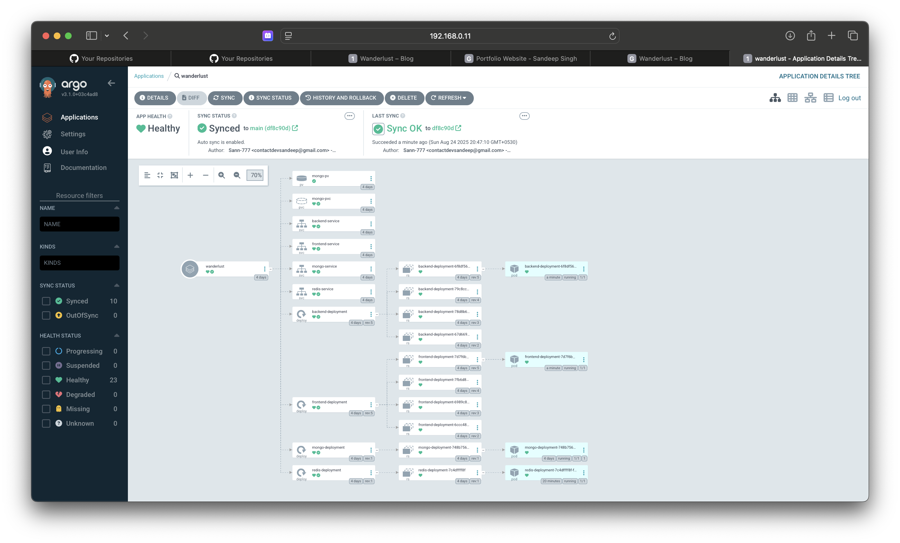

# Wanderlust - Your Ultimate Travel Blog 🌍✈️

WanderLust is a simple MERN travel blog website ✈ This project is aimed to help people to contribute in open source, upskill in react and also master git.


# Wanderlust – CI/CD Homelab Setup

This project is about setting up a CI/CD pipeline for a three-tier app named Wanderlust, which allows posting travel blogs. I built this setup in my homelab environment using Jenkins, Docker, Kubernetes (k3s), ArgoCD, SonarQube, Trivy, Prometheus, and Grafana.

The whole purpose of this lab was to practice real-world DevOps workflows but in a compact setup on my personal machines.

### <mark>Project Deployment Flow:</mark>


## Tech stack used in this project:
- GitHub (Code)
- Docker (Containerization)
- Jenkins (CI)
- OWASP (Dependency check)
- SonarQube (Quality)
- Trivy (Filesystem Scan)
- ArgoCD (CD)
- Redis (Caching)
- AWS EKS (Kubernetes)
- Helm (Monitoring using grafana and prometheus)

## 🏗️ Infrastructure Setup

* **Jenkins Server (MacBook)**

  * Installed **Java** and **Jenkins**.

* **Virtual Machine (VM on MacBook)** – acted as **Kubernetes master + CI agent**

  * Installed **Docker**, **Docker Compose**, **Java**, **kubectl**, **SonarQube**, **Trivy**.
  * Initialized a **k3s cluster** and made this VM the **master and control-plane**.

* **Worker Node (Physical Laptop)** – acted as **Kubernetes worker + CD agent**

  * Joined as a worker node to the k3s cluster.
  * Connected as a Jenkins agent.

👉 *Note: In a real-world cluster, I would separate all these services on different nodes. But since this was a homelab, I kept it compact.*

---

## ⚙️ Jenkins Setup

1. Added **VM and Worker Node** as **Jenkins agents**.

   * CI pipeline runs on the **VM (master node)**.
   * CD pipeline runs on the **worker node**.

2. Configured **credentials** in Jenkins for:

   * GitHub
   * Docker Hub
   * SonarQube token (stored as secret text)

3. Configured **SonarQube webhook** → Jenkins IP.

4. Configured **SMTP on port 465** in Jenkins for **email alerts** (pipeline success/failure).

5. Installed Jenkins plugins:

   * OWASP Dependency Check
   * SonarQube Scanner
   * NodeJS
   * Docker
   * Pipeline Stage View
   * Blue Ocean

6. Set SonarQube Scanner to install automatically.

7. Added **shared libraries (Groovy)** in GitHub for reusable Jenkins functions.

   * Connected them under **Global Trusted Shared Libraries** in Jenkins.

### 🔗 Jenkins Shared Library

You can check my shared library code here:  
[👉 Shared Library Repo](https://github.com/Sann-777/Jenkins-shared-libraries)

- <b>Jenkins Dashboard Screenshot</b>


## 🔐 CI/CD Pipeline

* **CI Pipeline**

  * Code checkout from GitHub.
  * Static code analysis with **SonarQube**.
  * Dependency scanning with **OWASP**.
  * Vulnerability scanning with **Trivy**.
  * Docker image build & push to Docker Hub.

* **CD Pipeline**

  * Triggered automatically after CI success.
  * Uses **ArgoCD** to sync GitHub repo → Kubernetes cluster.
  * Deploys the **Wanderlust app** on the worker node.
  * Email notification (SMTP) sent after deployment.

### How pipeline will look after deployment:
- <b>CI pipeline to build and push</b>


- <b>SonarQube Quality Gate</b>


- <b>CD pipeline to update application version</b>


---

## 🚀 ArgoCD Setup

1. Created a namespace for ArgoCD on VM:

   ```bash
   kubectl create ns argocd
   ```

2. Installed ArgoCD using Helm.

3. Stored login credentials in Kubernetes secrets.

4. Connected GitHub repo to ArgoCD (via Git URL).

5. Added my k3s cluster to ArgoCD:

   ```bash
   kubectl config get-clusters
   ```

6. Created an application in ArgoCD:

   * Defined app name, project name.
   * Enabled **prune** and **auto-heal**.
   * Linked GitHub repo + deployment manifests path.

- <b>ArgoCD application for deployment on Cluster</b>


---

## 📊 Monitoring with Prometheus & Grafana

1. Installed **Prometheus** and **Grafana** via Helm on the **worker node**.
2. Used **nodeSelector** (opposite of taint/toleration) to ensure they run specifically on the worker node.
3. Connected Prometheus to Grafana.
4. Added dashboards to visualize **Kubernetes cluster metrics**.

- <b>Grafana Dashboard to view System Metrics</b>


---

## 📝 Notes

* Compact homelab setup for practice.
* In production → everything should be **separated** (Jenkins, ArgoCD, monitoring, SonarQube on different servers).
* Shared library approach helped make Jenkins pipelines **clean and readable**.

---

## ▶️ How to Run (For Readers Who Want to Try)

1. Clone the repo:

   ```bash
   git clone https://github.com/Sann-777/CI-CD-Mega-Project.git
   ```

2. Run CI pipeline in Jenkins.

3. CI triggers CD pipeline automatically.

4. Application deployed on Kubernetes cluster via ArgoCD.

5. Monitor using Grafana dashboards.

---

That’s the whole setup of **Wanderlust CI/CD pipeline in homelab** 🌍✈️